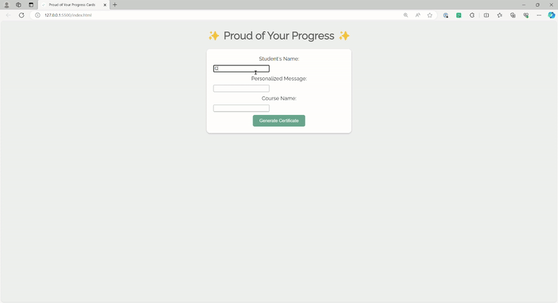

# [JSL07] Submission: Proud of your Progress

You will:
1. Use the provided Starter Code Repository: https://github.com/CodeSpace-Academy/Module_8_StudentNo_Classcode_Group_Name-Surname_JSL08
2. Code your solution.
3. Commit changes to your GitHub repository.
4. Submit the GitHub Repository Link to the LMS [JSL08] Submission Project Tab.

This one will be a little tricky. So check out this overview first: https://www.youtube.com/watch?v=sJ-c3BA-Ypo

Check out the practice challenges on Scrimba here: https://scrimba.com/playlist/pKJewwyu4

A Singleton pattern ensures that a class has only one instance and provides a global point of access to it. For our banking system, let's use the Singleton pattern to manage the bank's branch information.

# Expected Result

Design patterns like Singleton, Factory, and Observer can significantly improve the structure and maintainability of your JavaScript projects, making your code cleaner and more efficient. By understanding and applying these patterns, you'll be well-equipped to tackle complex design challenges in your projects, just as a well-organized bank efficiently manages its operations and services.

## What You Need to Do:

1. Clone the provided Starter Code Repository to your local development environment (e.g., VSCode): https://github.com/CodeSpace-Academy/Module_8_StudentNo_Classcode_Group_Name-Surname_JSL08
2. Open the cloned project in your code editor.
3. Code your solution for each of the challenges as per the provided instructions.
4. Commit your changes to your local Git repository with meaningful commit messages.
5. Push your local Git repository to your GitHub account.
6. Verify that the changes have been successfully pushed to your GitHub repository.

## What You Need to Include:

1. Ensure that your code includes the necessary modifications to meet the challenge requirements.
2. Your GitHub repository should contain the updated code files.

## How We'll Assess Your Work:

1. We will review your GitHub repository to ensure that it contains the updated code files.
2. We will assess the modifications made to the code to verify that they effectively meet the challenge requirements.
3. We will consider the commit history and meaningful commit messages to evaluate your coding process.

This challenge will test your ability to create a function with the Singleton Pattern. Woohoo! Your first design pattern!

